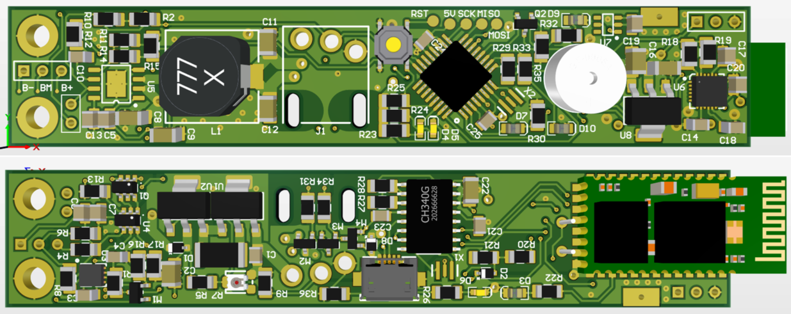
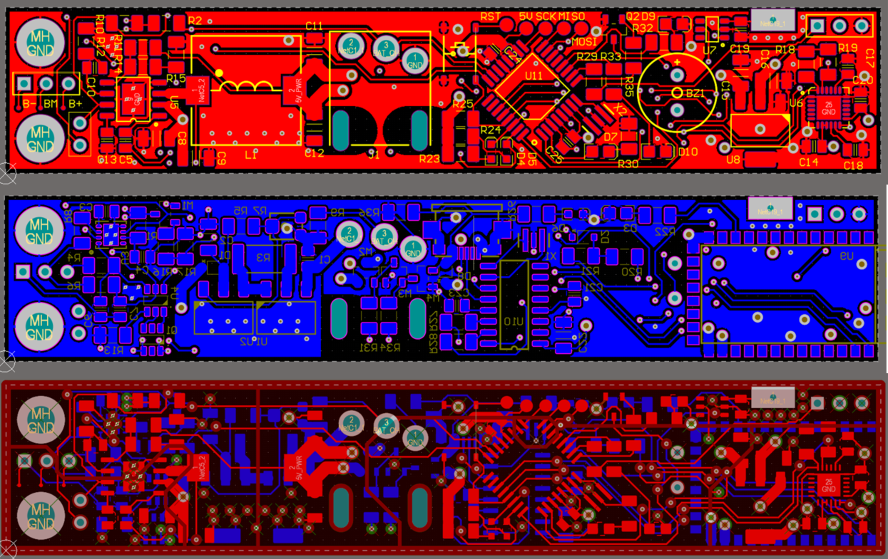
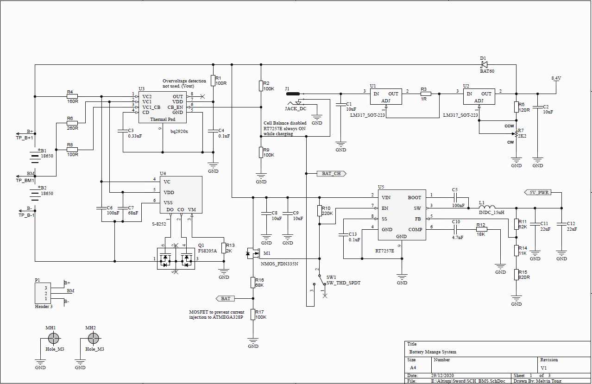
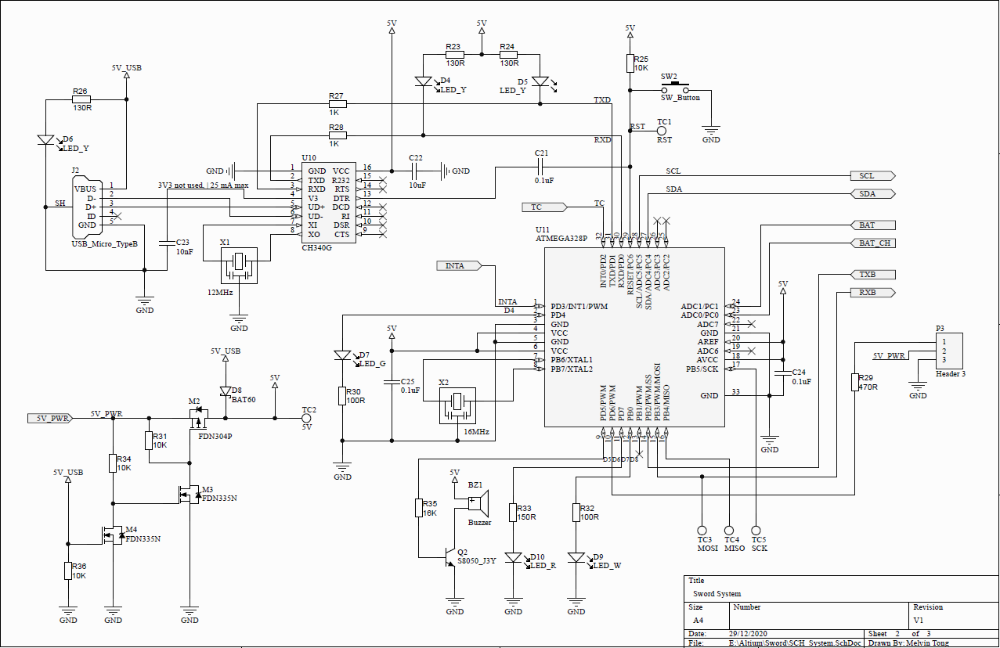
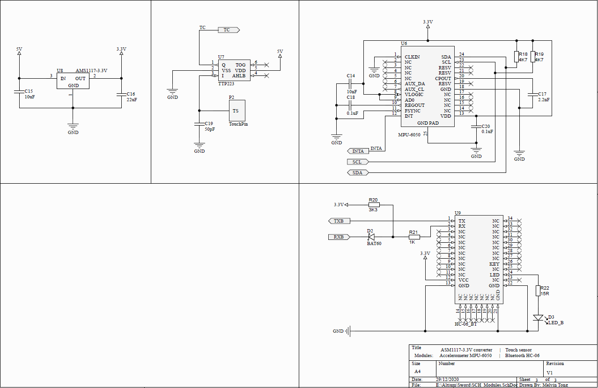

# SwordLED_v2
Arduino LED system embeded in a softcombat sword.
Features:
- BMS for 2S 18650 batteries with automatic cell balance.
- 2S 18650 charger (Vin=12V).
- 5V Buck converter up to 3A
- Arduino ATmega328P with USB
- Bluetooth module HC-06
- 3 axis Accel/gyro MPU-6050
- Touch sensitive button & beeper.

